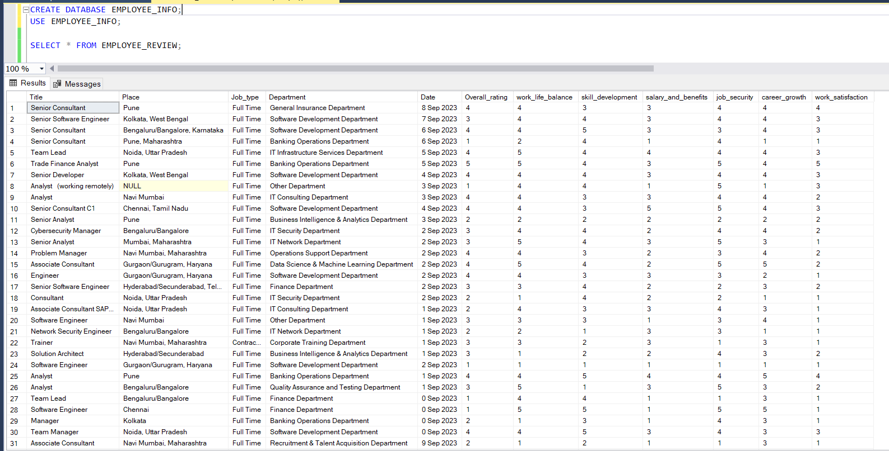
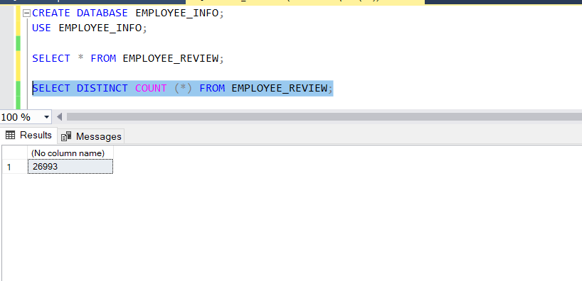
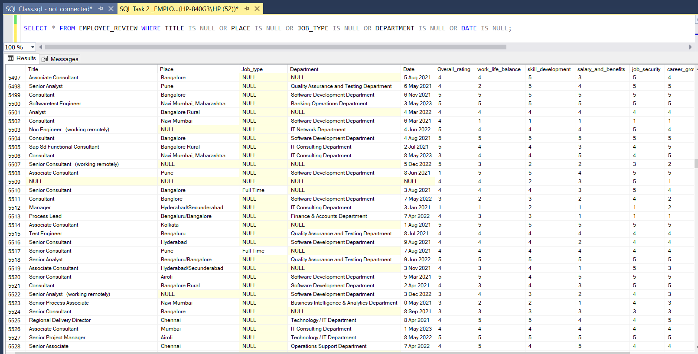
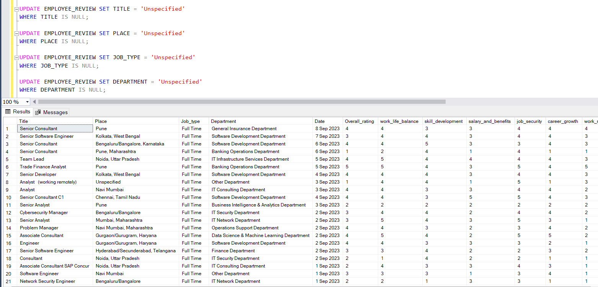
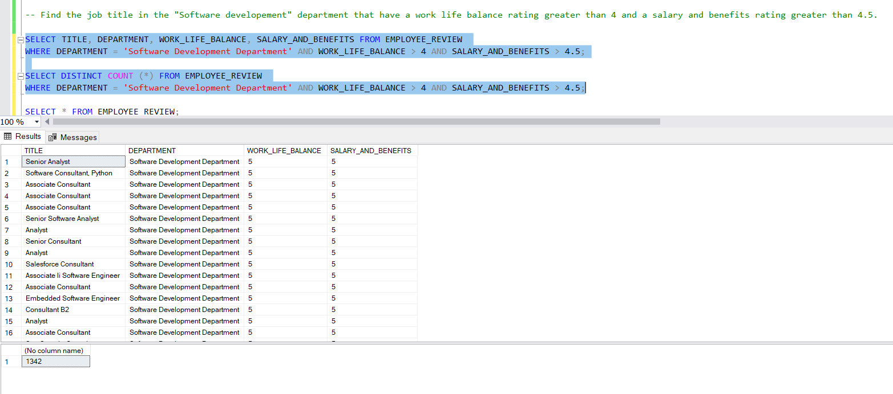
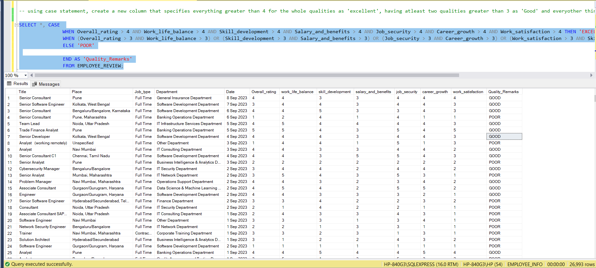
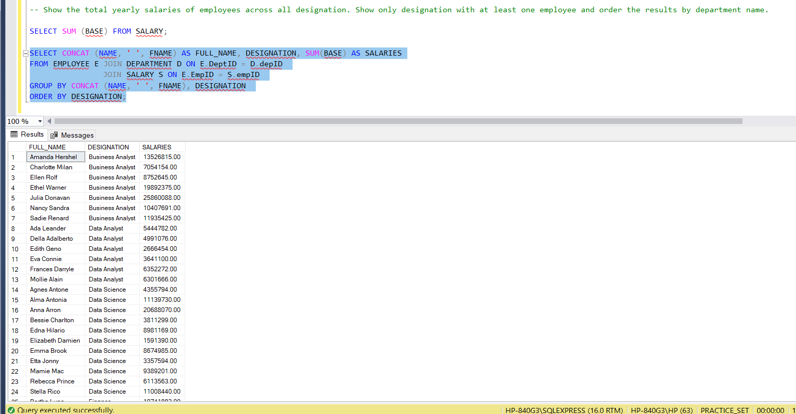
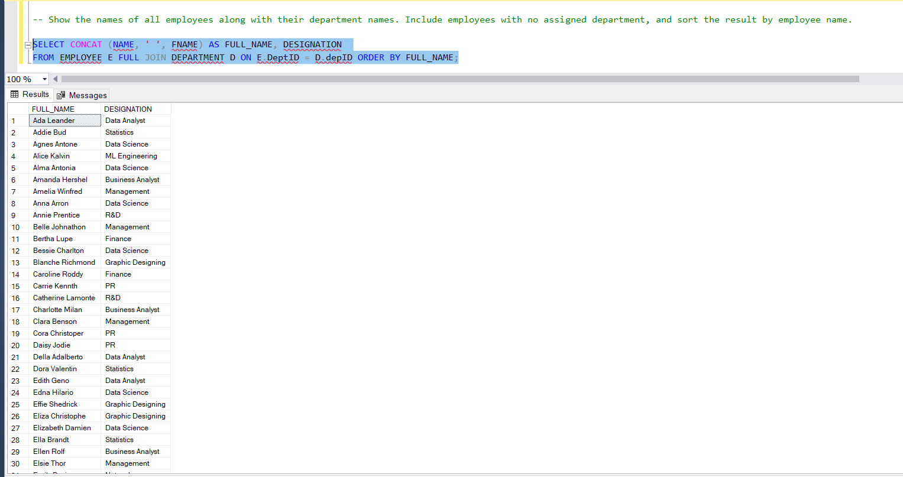
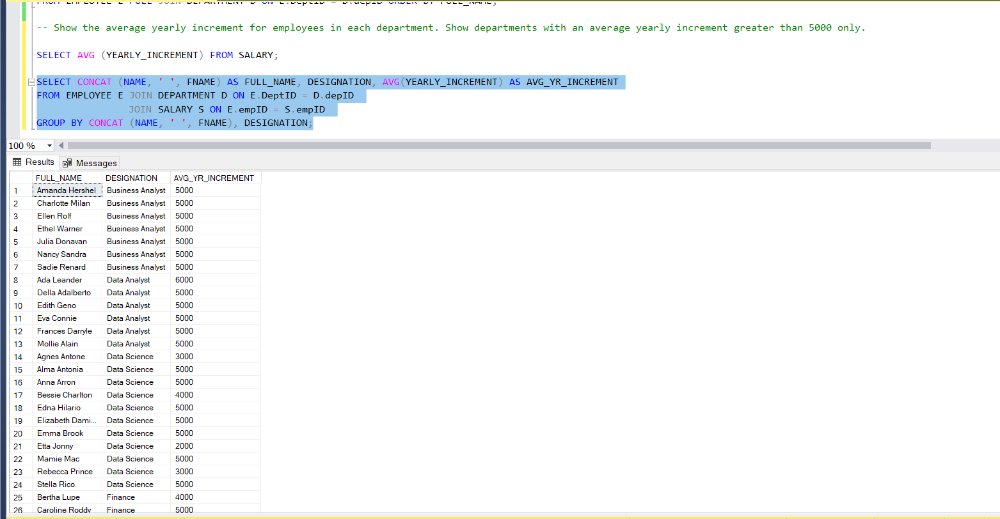
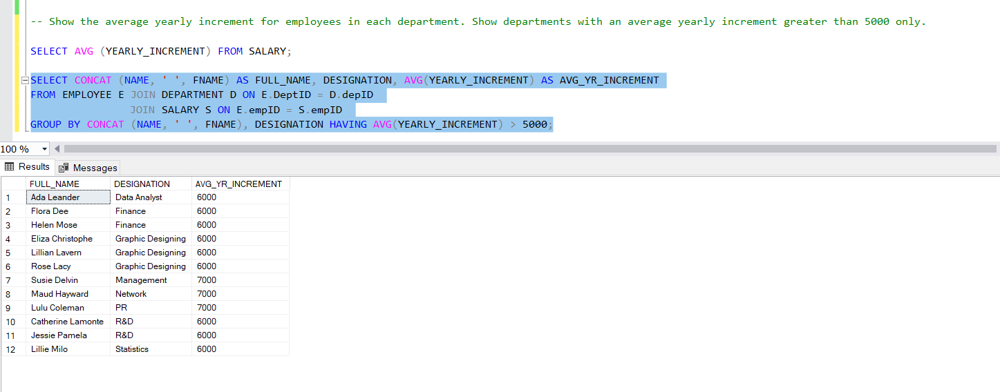

# DreamTech Employee Review 💻

# Introduction
DreamTech Company, a fictional company hypothetically hired me to take a full analysis of the company's employees' working information, attitude to work and quality of work. This project is aimed at showcasing more of SQL using advanced functions and JOINS as I explore the magical world of queries. 

Disclaimer ⚠️- All data used for this analysis are hypothetical data generated and do not represent any company's data or an attempt to endanger their performance.

## Problem Statement
The primary goal of this analysis is to gain valuable insights into DreamTech's employees and how efficient their work habits are as regards to the company. This will help me answer some valuable questions and come up with a data-derived conclusion for better employer-employee performance in the company. I will be using the data to answer these:
- Find the job title in the "Software development" department that has a work-life balance rating greater than 4 and a salary and benefits rating greater than 4.5
- Using CASE statement, create a new column that specifies everything greater than 4 for the whole qualities as 'excellent', having at least two qualities greater than 3 as 'Good' and every other thing as 'poor'
- Show the total yearly salaries of employees across all designations. Show only designation with at least one employee and order the results by department name.
- Show the names of all employees along with their department names. Include employees with no assigned department, and sort the result by employee name.
- Show the average yearly increment for employees in each department. Show departments with an average yearly increment greater than 5000 only.

## Skills/Concept Demonstrated
In this project, I explored more of SQL making use of functions like SELECT DISTINCT and SELECT WHERE, logical and comparison operators, string functions (REPLACE, UPDATE, LEN, CHARINDEX, CONCAT), aggregate functions (SUM, AVERAGE, COUNT, MIN and MAX), conditional formatting like the CASE statement, GROUP BY, ORDER BY, HAVING clause and JOINS (OUTER JOIN, INNER JOIN and FULL JOIN).

## Data Sourcing
The dataset was provided as an Excel file, which was imported into a newly created database in the SQL server. The dataset comprised four different tables, which contained information about the company's employees, their various departments, salaries, job-type, yearly increments etc.

## SQL Fundamentals and Analysis
- **View Tables**: The flat file was imported into a newly created database. Queries were written in their right syntax to view the tables and the table count.

                                                             |                                            
:------------------------------------------------------------------------------:|:-----------------------------------------------------------------------------------------------|

- **Null Values**: Next, the null values in our tables were identified and updated for easy analysis. The categorical data with null values were updated with "Unspecified", while the numerical data with null values were updated with the average value of the column.

                                                      |                                                    
:------------------------------------------------------------------------------:|:-----------------------------------------------------------------------------------------------|

- **Question 1**: Find the job title in the "Software development" department that has a work-life balance rating greater than 4 and a salary and benefits rating greater than 4.5.

- **Question 2**: Using case statement, create a new column that specifies everything greater than 4 for the whole qualities as 'excellent', having atleast two qualities greater than 3 as 'Good' and everyother thing as 'poor'

- **Question 3**: Show the total yearly salaries of employees across all designations. Show only designation with at least one employee and order the results by department name.

- **Question 4**: Show the names of all employees along with their department names. Include employees with no assigned department, and sort the result by employee name.

- **Question 5**: Show the average yearly increment for employees in each department. Show departments with an average yearly increment greater than 5000 only.

                                                                     |                                                    
:------------------------------------------------------------------------------------:|:--------------------------------------------------------------------------------------|

## Conclusion 
- The tables came with a lot of null values out of the total count of 26993, about 2000 cells had null values, which were updated with "Unspecified". To comprehensively understand these unspecified kind of categories to enable informed decisions, data shoukd be collected carefully to avoid bias.
- A large number of employees had POOR quality remarks as their overall review, rating their general work habits and benefits, followed by an average rating of GOOD and then EXCELLENT, for those with ratings over 5 in all categories.
- From the set, employees with yearly increment greater than 5000 were only 12 in number. No currency was specified in our fictional dataset, which makes the salaries and increment a little bit unattractive.😏

**PEACE OUT** ✌️

